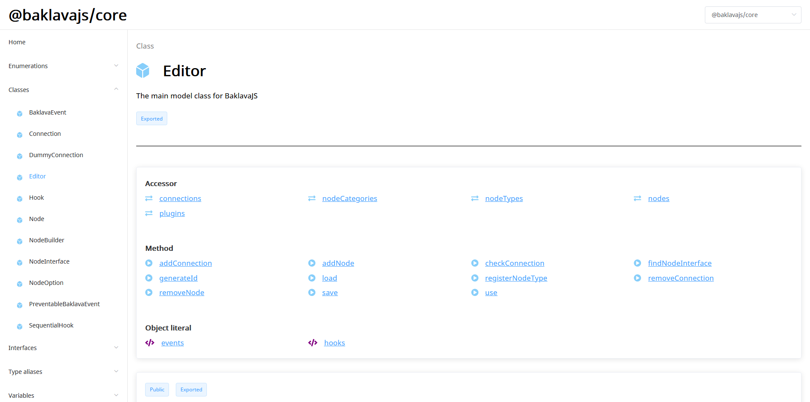

# Typedoc SPA



This project is an alternative to the static HTML files produced by Typedoc. Instead, it dynamically loads the JSON file from Typedoc, which are much smaller. This also means that no data is loaded when viewing different classes, creating a better user experience.

[Example](https://newcat.github.io/baklavajs/api/index.html)

## Usage

1. Create a JSON file containing the type informations. You can do this using the command `typedoc --json output.json`
2. Download the `typedoc-spa.js` and `typedoc-spa.css` files from the [Releases](https://github.com/newcat/typedoc-spa/releases) page
3. Create an `index.html` file that looks like this:
```html
<!DOCTYPE html>
<html lang="en">
<head>
    <meta charset="UTF-8">
    <meta name="viewport" content="width=device-width, initial-scale=1.0">
    <meta http-equiv="X-UA-Compatible" content="ie=edge">
    <link rel="stylesheet" href="typedoc-spa.css">
    <link rel="stylesheet" href="https://fonts.googleapis.com/css?family=Noto+Sans"> 
    <title>My Typedoc App</title>
</head>
<body>
    <div id="app"></div>
    <script>
    window.$typedoc = {
      modules: [
        { name: "My Module", file: "output.json" }
      ]
    }
    </script>
    <script src="typedoc-spa.js"></script>
</body>
</html>
```
4. Put the `index.html`, `output.json`, `typedoc-spa.js` and `typedoc-spa.css` files into one folder and serve them using a simple webserver - done!